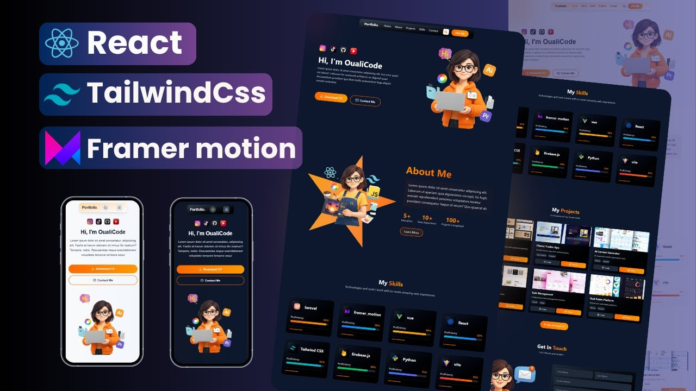

# Yukta Savdekar Portfolio



A personal portfolio website built with React, Vite, Tailwind CSS, and Framer Motion. It presents my profile, technical skills, certifications, selected projects, resume download, contact details, responsive layouts, animated sections, a project carousel, and dark/light theme support.

## Features

- Responsive portfolio layout
- Animated landing page and section-wise transitions
- Project carousel with image-based project cards
- Resume-based About Me and Technical Skills sections
- Dark mode and off-white light mode
- Contact section with LinkedIn, GitHub, email, and phone links

## Tech Stack

- React
- Vite
- Tailwind CSS
- Framer Motion
- Lucide React

## Project Sections

- Hero section with animated introduction
- About Me section with profile highlights and education
- Technical Skills and certifications
- Project showcase slider
- Contact section

## Run Locally

```bash
npm install
npm run dev
```

## Build for Production

```bash
npm run build
```

## Author

Yukta Savdekar

- LinkedIn: [linkedin.com/in/yukta-savdekar-ab59b0272](https://www.linkedin.com/in/yukta-savdekar-ab59b0272)
- GitHub: [github.com/yukta0708](https://github.com/yukta0708)
